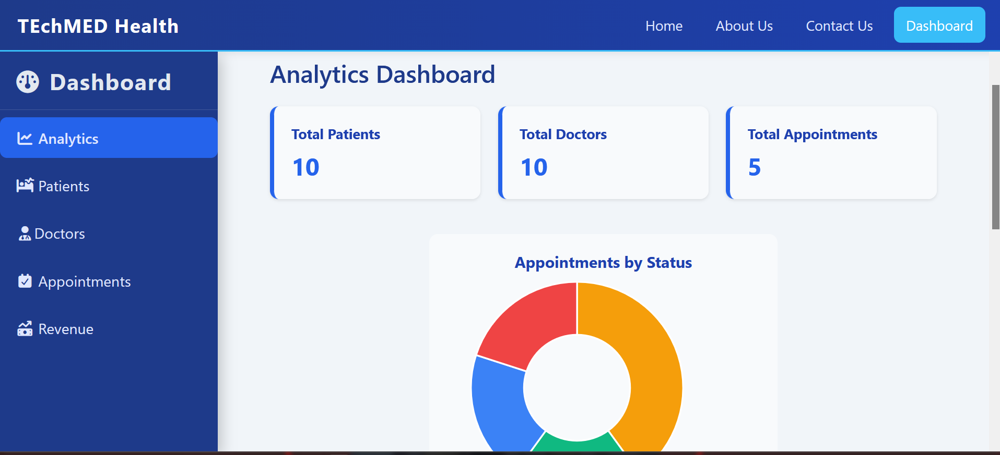
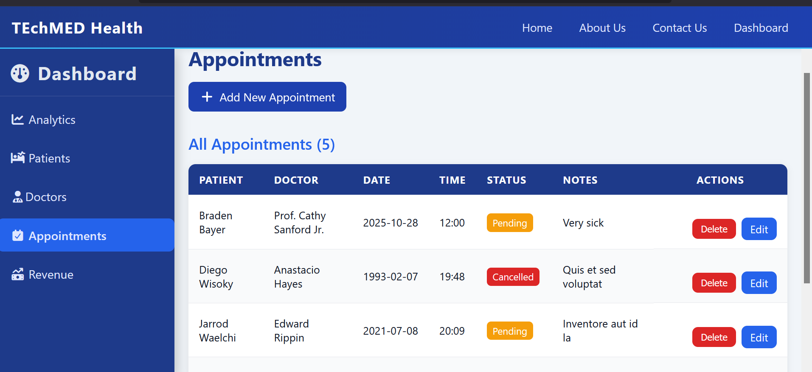
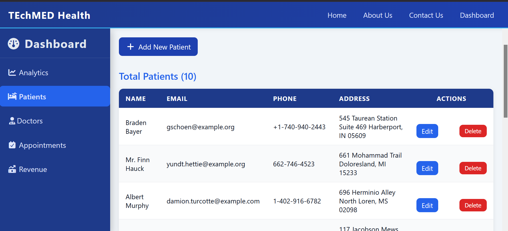

# 🏥 Laravel Hospital Management System

A modern, user-friendly Hospital Management System built with **Laravel**.  
It helps hospitals manage patients, doctors, appointments, billing, and analytics in a seamless and efficient way.

---

## 🚀 Features

### 🧑‍⚕️ Core Modules
- **Patient Management** – Add, edit, and view patient information  
- **Doctor Management** – Manage doctor profiles and specialties  
- **Appointment Scheduling** – Book, update, and track patient appointments  
- **Analytics Dashboard** – Visual charts and data insights for admins  
- **Authentication System** – Secure login and user roles  
- **Responsive Design** – Works perfectly on desktop and mobile  

---

## 🖥️ Screenshots

| Dashboard | Appointments | Patients |
|------------|---------------|-----------|
|  |  |  |

*(You can replace the image paths above with your actual screenshots.)*

---

## ⚙️ Installation

### 1️⃣ Clone the Repository
```bash
git clone https://github.com/yourusername/laravel-hospital-management-system.git
cd laravel-hospital-management-system
```
2️⃣ Install Dependencies
``bash composer install
  npm install
``
