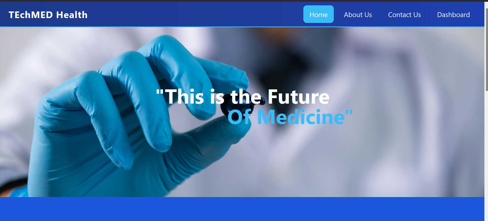
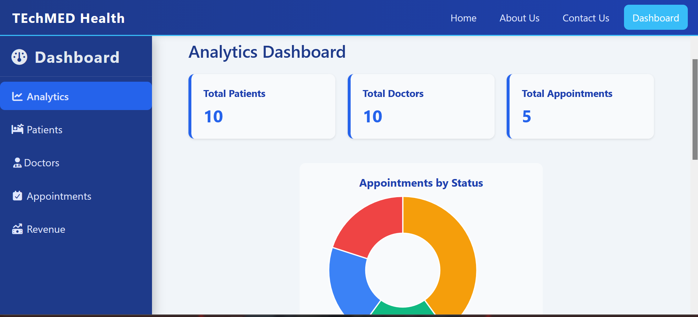
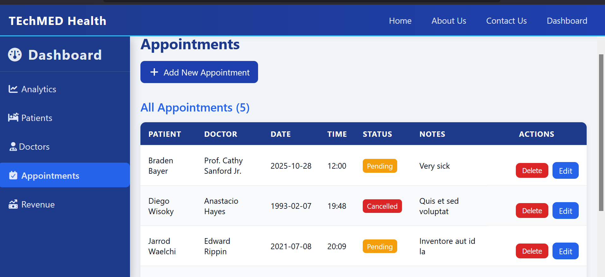
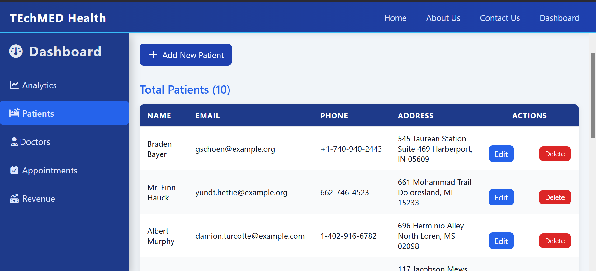

# 🏥 Laravel Hospital Management Syste

A modern, user-friendly **Hospital Management System** built with **Laravel**.  
It helps hospitals manage **patients, doctors, appointments, billing, and analytics** efficiently in one unified platform.

---

## 🚀 Features

### 🧑‍⚕️ Core Modules
- **Patient Management** – Add, edit, and view patient information  
- **Doctor Management** – Manage doctor profiles and specialties  
- **Appointment Scheduling** – Book, update, and track appointments  
- **Analytics Dashboard** – Visual charts and data insights for admins  
- **Authentication System** – Secure login with role-based access control  
- **Responsive Design** – Fully optimized for desktop, tablet, and mobile  

---

## 🖥️ Screenshots

|Home| Dashboard | Appointments | Patients |
|------------|---------------|-----------|
|  |  |  |  | 

---

## ⚙️ Installation Guide

### 1️⃣ Clone the Repository
```bash
git clone https://github.com/yourusername/laravel-hospital-management-system.git
cd laravel-hospital-management-system
```

### 2️⃣ Install Dependencies
```bash
composer install
npm install
```

### 3️⃣ Configure Environment
Copy the example environment file:
```bash
cp .env.example .env
```

Then update your database credentials in `.env`:
```env
DB_DATABASE=hospital_db
DB_USERNAME=root
DB_PASSWORD=
```

### 4️⃣ Generate Application Key
```bash
php artisan key:generate
```

### 5️⃣ Run Migrations and Seed Data
```bash
php artisan migrate --seed
```

### 6️⃣ Start the Development Server
```bash
php artisan serve
```

Now open your browser and visit:  
👉 [http://127.0.0.1:8000](http://127.0.0.1:8000)

---

## 📊 Admin Dashboard Overview

- View total patients, doctors, and appointments  
- Visualize appointment status using **Chart.js**  
- Monitor recent activities and appointment tracking  

---

## 🧱 Tech Stack

| Component | Technology |
|------------|-------------|
| **Framework** | Laravel 11 |
| **Frontend** | Blade Templates, CSS, Font Awesome |
| **Charts** | Chart.js |
| **Database** | MySQL / MariaDB |
| **Authentication** | Laravel Breeze / Fortify |
| **Server** | PHP 8.3+ |

---

## 🤝 Contributing

Contributions are welcome!  
To contribute:

1. **Fork** the repository  
2. **Create** a new branch (`feature/your-feature`)  
3. **Commit** and **push** your changes  
4. **Open** a Pull Request  

---

## 🛡️ License

This project is licensed under the **MIT License**.  
Feel free to use, modify, and distribute it.

---

## 💬 Author

**Wade Calvin**  
📧 Email: [wadecalvin9@gmail.com](mailto:wadecalvin9@gmail.com)  
🌐 GitHub: [@wadecalvin9](https://github.com/wadecalvin9)

---
